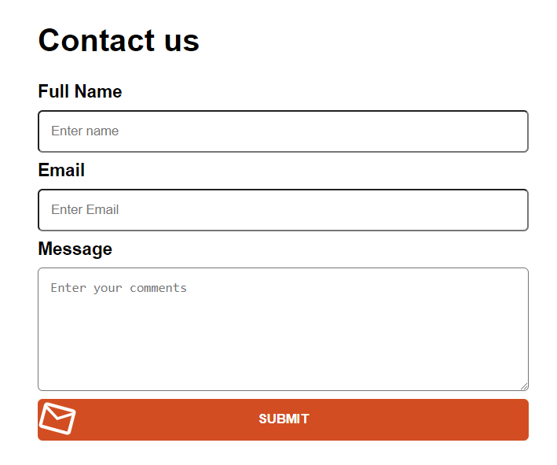
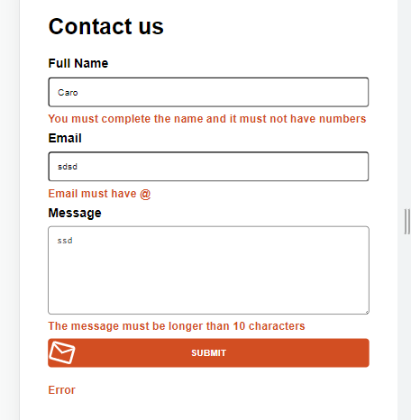
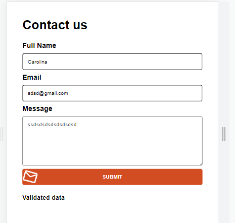
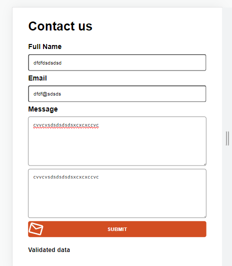

# ACTIVIDAD REACT CURSO FRAMEWORKS Y ENTORNOS WEB INESEM

## Descripción Actividad 1
Crear formulario de contacto que trabaje con input y textarea, validar datos y trabajar recogida de datos con onChange y useState, maquetación responsive design

## Diseño y maquetación responsive

### Vista web

### Vista mobile

### Validaciones
 ### Se ha validado que nombre tenga más de 5 caracteres y que no contenga números
 ### Se ha validado que email contenga @
 ### Se ha validado que el textarea tenga más de 10 caracteres
 ### En caso contrario se muestran mensajes de errores de validación
 
 ### Si los datos son correctos se muestra mensaje de validado
 

## Descripción actividad 2
Crear un segundo textarea sólo de lectura que muestre los datos que se escriben en el primero

