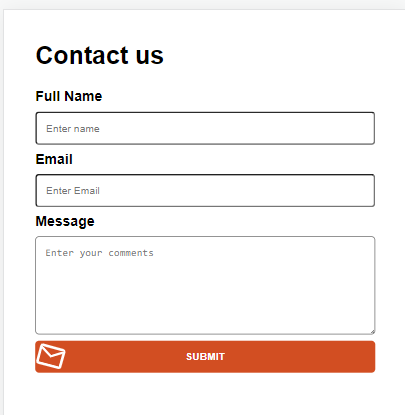

# ACTIVIDAD REACT CURSO FRAMEWORKS Y ENTORNOS WEB INESEM

## Descripción
Crear formulario de contacto que trabaje con input y textarea, validar datos y trabajar recogida de datos con onChange, integrar redux para la recogida de datos, maquetación responsive design

## Diseño y maquetación responsive

### Vista web

### Vista mobile
